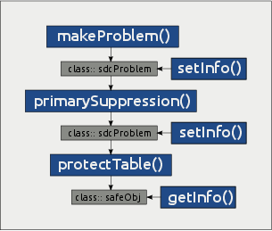

# **sdcTable** Vignette

## About this vignette
The purpose of the **sdcTable** vignette is to show how to get up and running with **sdcTable**; for details, including a complete list of options, consult the help pages or the manual for the following main functions of the package:

- `makeProblem` using e.g: `help('makeProblem')` or `?makeProblem`
- `primarySuppression` using e.g: `help('primarySuppression')` or `?primarySuppression`
- `protectTable` using e.g: `help('protectTable')` or `?protectTable`
- `setInfo` using e.g: `help('setInfo')` or `?setInfo`
- `getInfo` using e.g: `help('getInfo')` or `?getInfo`

## How to protect data - An overview

{#fig:overview}

The main functions that are exported to users are shown in [Figure 1](#fig:overview). 

Function `makeProblem()` is used to create objects of class `sdcProblem`. Instances of class `sdcProblem` hold the entire information that is required to perform primary or secondary cell suppression such as assumed to be known upper and lower cell bounds or upper-, lower- or sliding protection levels that are required to fulfill when solving the secondary cell suppression problem. All this information can be modified using function `setInfo()`.

`primarySuppression()` is applied to objects of class `sdcProblem`. By setting function parameters users can choose and apply a pre-defined primary suppression rule. Using `setInfo()`, one can easily implement a custom primary suppression rule, too. 

Function `protectTable()` is used to protect primary sensitive table cells in objects of class `sdcProblem`. A successful run of  function `protectTable()` results in an object of class `safeObj`.  Using `getInfo()` one can extract information from objects  of such class, most importantly of course a data set containing all table cells along with the suppression pattern.

More detailed information on all the possibilities is available in the help-files, additional information is given in the corresponding sections of this vignette that deal with specific functions. The first step however to get started is to load the package, which can easily be done as  shown below:

```{r, echo=F}
suppressPackageStartupMessages(library(sdcTable))
```


```{r, eval=TRUE}
library(sdcTable)
packageVersion("sdcTable")
```

# A simple example

```{r, echo=FALSE}
# daten laden
workDat <- get(load('workDat.RData'))
inputData <- workDat$inputData
microData <- inputData$microDat
aggregatedData <- inputData$aggDat
dimList <- inputData$dimList

resOPT <- workDat$resOPT

completeData <- getInfo(workDat$resOPT, 'finalData')
completeData <- completeData[,-ncol(completeData)]
```

We now walk through the steps that are required to protect tabular data using **sdcTable**. In the first example we are going to protect table cells given a three-dimensional tabular structure with some sub-totals. 

We will start by discussing input data sets in sections ["Starting from microdata"](#ex1:microDat) and ["Using aggregated data"](#ex1:aggDat). Then we continue by discussing how to define and describe dimensional variables in ["Defining hierarchies"]{#ex1:hier} which is a crucial step in the entire procedure. Once the hierarchies are defined it is necessary to create suitable objects as described ([here](#ex1:makeProb)) that can be used to identify and suppress primary sensitive cells. This is shown in section ["Identifying sensitive cells"](#ex1:primSupp). Finally we discuss how to ["protect primary sensitive table cells"](#ex1:secondSupp).

Throughout it is also shown how to set and extract information from the objects we are working with using functions `getInfo()` and `setInfo()`.

### Starting from microdata {#ex1:microDat}
In this example we suppose we have collected data from ``r nrow(microData)`` individuals. A subset of the available data is shown below: 
```{r, echo=FALSE}
print(head(microData), row.names=FALSE)
```

We note that the information we have obtained for any individual corresponds to exactly one row in the input data.frame. That is supposed to be available in **R**. 

The micro data consist of ``r ncol(microData)`` variables. The first 3 variables (`V1`, `V2` and `V3`) are categorical variables that will later define the table that needs to be protected. Variables 'numVal1' and 'numVal2' correspond to arbitrary variables containing some kind of information measured for each individual.

To create the tabular structure that is required to protect any table cells within the table it is of course of interest to have a look at possible values or characteristics of the categorical variables that define the table.

```{r, echo=FALSE}
lev.V1 <- as.character(sort(unique(microData$V1)))
lev.V2 <- as.character(sort(unique(microData$V2)))
lev.V3 <- as.character(sort(unique(microData$V3)))
```

- Variable `V1`: this variable has a total of ``r length(lev.V1)`` codes without subtotals which are listed below:
```{r, echo=FALSE}
print(lev.V1)
```

- Variable `V2`: this variable has a total of ``r length(lev.V2)`` codes without subtotals which are listed below:
```{r, echo=FALSE}
print(lev.V2)
```
- Variable `V3`: this variable has a total of ``r length(lev.V3)`` codes without subtotals which are listed below:
```{r, echo=FALSE}
print(lev.V3)
```

The step on how to define level-hierarchies that have to include all possible (sub)totals is explained [below](#ex1:hier).

### Using aggregated data {#ex1:aggDat}
Using **sdcTable** it is also possible to start with a *'complete'* dataset. This means that the input dataset already contains rows with all possible level-combinations that can occur. This also includes combinations with (sub)totals. In this case it is required that the input data contain a column holding cell counts. Using the example data already discussed in section ["Starting from microdata"](#ex1:microDat), the complete dataset could be specified as shown below:

```{r}
print(tail(completeData))
```

```{r, echo=FALSE}
levComp.V1 <- as.character(dimList$V1[,2])
levComp.V2 <- as.character(dimList$V2[,2])
levComp.V3 <- as.character(dimList$V3[,2])
```

Even though we only show a small subset of the data it is immediately clear that in object `completeData` (sub)totals are listed. These combinations can be calculated from the microdata by summation over several codes in one or more dimensional variables. As in section [Starting from microdata](#ex1:microDat) it is of interest which codes were specified for each dimensional variable. This information is given below:

- Variable `V1`: this variable has a total of ``r length(levComp.V1)`` codes including all possible subtotals which are listed below:
```{r, echo=FALSE}
print(levComp.V1)
```
- Variable `V2`: this variable has a total of ``r length(levComp.V2)`` codes including all possible subtotals which are listed below:
```{r, echo=FALSE}
print(levComp.V2)
```
- Variable `V3`: this variable has a total of ``r length(levComp.V3)`` codes including all possible subtotals which are listed below:
```{r, echo=FALSE}
print(levComp.V3)
```

```{r, echo=FALSE}
x <- completeData[nrow(completeData),]
```

We also note that in `completeData` a variable `Freq` is available which gives information on the corresponding cell counts. This means that for example a total of ``r x$Freq`` individuals contribute to the table cell where variable `V1` equals ``r x$V1``, variable `V2` is ``r x$V2`` and variable `V3` is equal to ``r x$V3``. 

Whether or not one starts to work with micro data or already with a complete, pre-aggregated dataset the next step is always the definition of the hierarchies defining the tabular structure.


### Defining hierarchies {#ex1:hier}
We could see [here](#ex1:microDat) (for micro data) and [here](#ex1:aggDat) (for pre-aggregated data) that the set of codes available in the input data for variables `V1`, `V2` and `V3` differ since in the case where micro data are used as input data, no codes for subtotals are included in the micro data while in the case where pre-aggregated data are used those subtotals must already be included in the input data set.

When defining the complete hierarchies, no (sub)-totals must be excluded from the description. This means that for each variable defining one dimension of the table the complete structure must of course includes all (sub)totals.

In this example the hierarchies we want to define are quite basic. We start by showing the level-codes for each variable `V1`, `V2` and `V3` that are included in `completeData` but not in `microData`.

- (sub)totals of variable `V1`:

```{r, echo=FALSE}
subTots.V1 <- setdiff(levComp.V1, lev.V1)
print(subTots.V1)
```

- (sub)totals of variable `V2`:
```{r, echo=FALSE}
subTots.V2 <- setdiff(levComp.V2, lev.V2)
print(subTots.V2)
```

- (sub)totals of variable `V3`:
```{r, echo=FALSE}
subTots.V3 <- setdiff(levComp.V3, lev.V3)
print(subTots.V3)
```

We observe that variable `V1` has two codes (``r subTots.V1[1]`` and ``r subTots.V1[2]``) that can be calculated from the codes of `V1` available in the micro data set `microData`. For variables `V2` and `V3` only one total value (``r subTots.V2[1]``) exists which means the summation over all characteristics of variables `V2` and `V3` is the (only) total value. 
To specify the complete structure of a dimensional variable one needs to create a data frame or a matrix for each of those variables. The structure of any object describing a dimensional variable be created as follows:

- the object must consist of exactly 2 columns, both being character vectors
- the first column specifies levels
- the second column specifies level-codes
- the only allowed character in the first column is `@`
- the length of the strings of the first column defines the (numeric) level of the corresponding code
- a top-down approach has to be taken
- the object must contain a row for each possible level-code

While this may sound difficult, it is in fact quite easy to create such objects
within **R**. We will now explain how to create the required objects for the
dimensional variables `V1`, `V2` and `V3` used in the example.

#### defining level-structure for variable `V1`
The hierarchy we want to describe is as follows. The overall code ``r subTots.V3[1]`` is calculated from the codes (`A`, `B`, `C` and `D`). Additionally, code `B` (which is the second (sub)total-code for variable `V1` as described [here](#ex1:aggDat)) can be calculated from the level-codes `Ba`, `Bb` and `Bc`.

Following rule 1, we have to create a data frame or matrix  consisting of two columns, the first specifying levels, the second column the corresponding level codes. Since we have to follow a top-down approach, the first level code must always correspond to the grand total which is always considered as the code with a level equaling 1. Thus, we create the matrix with a single row defining the overall total as follows:

```{r}
dimV1 <- matrix(nrow=0, ncol=2)
dimV1 <- rbind(dimV1, c('@','Tot'))
print(dimV1)
```

The level code for the overall total is `@` because according to rule 4 it is the only allowed character in the first column and it consists of exactly 1 character. Also, since the overall total is defined as level 1, the number of characters of the string `@` and the level of the overall total code `Tot` matches.

The next step is to add additional codes. As mentioned before, codes `A`, `B`, `C` and `D` contribute the the overall total. Therefore we know that these codes are considered as level 2 codes and must be (according to the top-down approach) listed below the overall total code. Adding these codes to object `dimV1` is shown below:

```{r}
mat <- matrix(nrow=4, ncol=2)
mat[,1] <- rep('@@',4)
mat[,2] <- LETTERS[1:4]
dimV1 <- rbind(dimV1, mat)
print(dimV1)
```

We know that code `B` is a subtotal that can be calculated from codes `Ba`, `Bb` and `Bc`. Since `B` is a code of level 2, the codes contributing to it must be of a lower level, in this case of level 3. We show below how to add the codes to object `dimV1`:

```{r}
mat <- matrix(nrow=3, ncol=2)
mat[,1] <- rep('@@@',3)
mat[,2] <- c('Ba','Bb','Bc')

dimV1 <- rbind(dimV1, mat)
print(dimV1)
```

Now object `dimV1` contains all possible codes along with their levels. However, it not valid because the top-down approach is violated. This means that codes that contribute to a (sub)total must be listed directly below it. If we would not change the order of object `dimV1`, **sdcTable** would assume that code `D` can be calculated by summation over codes `Ba`, `Bb` and `Bc`. For this reason it is necessary to move this *"block"* up so that it is directly below code `B`. The required code and the resulting correct object describing the structure of variable `V1` is printed below:

```{r}
dimV1 <- dimV1[c(1:3,6:8, 4:5),]
print(dimV1, row.names=FALSE)
```

Using this information, **sdcTable** internally calculates all kinds of information on dimensional variables. So for example it is able to deal with codes that can be (temporarily) removed from the structure because it can be considered as a *"duplicate"*. This is however not the case for this basic dimensional variable that has a total of 8 codes of which 6 are required to calculate information for the 2 (sub)totals.

Since versions `>= 0.27`, **sdcTable** allows to use inputs created from package [**sdcHierarchies**](https://CRAN.R-project.org/package=sdcHierarchies) as input. This package allows for a very simple way to create, compute and modify hierarchies. For a complete introduction, the package vignette can be viewed with `hier_vignette()`. The main functions are `hier_create()`, `hier_add()`, `hier_rename()` and `hier_delete()`. We now show an alternative way to generate the hierarchy for variable `V1`.

```{r}
dimV1 <- hier_create(root = "Tot", nodes = LETTERS[1:4])
dimV1 <- hier_add(dimV1, root = "B", nodes = c("Ba","Bb","Bc"))
hier_display(dimV1)
```

**sdcTable** will internally convert the tree-based structure generated using functionality from the [**sdcHierarchies**](https://CRAN.R-project.org/package=sdcHierarchies) package automatically into the `data.frame` based structure discussed at the begin of this section. 

#### defining level-structure for variable `V2`
The creation of a suitable object that describes the hierarchical structure of variable `V2` is easy. We are only dealing with one overall Total (`Tot`) that is the sum of all codes listed [here](#ex1:microDat) for this variable.

The code how to specify an object that describes the structure of dimensional variable `V2` is given below:

```{r}
dimV2 <- hier_create(root = "Tot", nodes = c("m", "w"))
hier_display(dimV2)
```

We see that the overall total (`Tot`) is again listed in the first row with the two other contributing codes (`m` and `w`) being below in the same hierarchy level.

#### defining level-structure for variable `V3`
The creation of a suitable object that describes the hierarchical structure of variable `V3` is easy. We are only dealing with one overall Total (`Tot`) that is the sum of all codes listed [here](#ex1:microDat) for variable `V3`.

The required code to generate an object specifying the hierarchical structure of
variable `V3` is given below:

```{r}
dimV3 <- hier_create(root = "Tot", nodes = letters[1:6])
hier_display(dimV3)
```

It is required to create an object defining the complete structure and hierarchies for each dimensional variable. Once this step has been done, the multidimensional tabular structure that is required to apply any statistical disclosure methods can be created using **makeProblem()**.

### Creating objects of class `sdcProblem` for further processing {#ex1:makeProb}
We now show how to create objects of class `sdcProblem` which can further be used to identify, suppress and protect sensitive table cells.

It was discussed [here](#ex1:microDat) and [here](#ex1:aggDat) how micro data and pre-aggregated data can be used as data-input objects. We will now explain how to create instances of class `sdcProblem` from both  `microData` and `completeData` and describe the required and optional parameters of function `makeProblem()`.

We start building a suitable object of class `sdcProblem` starting with the data on individual level available from object `microData`.

```{r}
dimInfo <- list(V1=dimV1, V2=dimV2, V3=dimV3)

prob.microDat <- makeProblem(
	data=microData,
	dimList=dimList,
	dimVarInd=1:3,
	freqVarInd=NULL,
	numVarInd=4:5,
	weightInd=NULL,
	sampWeightInd=NULL)
```

First we have to combine the objects describing the hierarchical variables `V1`, `V2` and `V3` into a list-object named `dimList`. Each list element is one of the objects created in section ["Defining hierarchies"](#ex1:hier). The names of the list-elements must correspond to the variable name that the corresponding list-element refers to. In this case, the first list-element - `dimV1` - should describe variable `V1` in the input data set `microData` when calling `makeProblem()` while the second list element - `dimV2` - defines the hierarchy of variable `V2` and `dimV3` - the third list element - describes the structure of variable `V3`.

The remaining parameters are quite self-explanatory and shorty described below:

- `data`: the data set that should be used, in this case `microData`
- `dimList`: a named list containing information on the structure of dimensional variables as described just above
- `dimVarInd`: the column indices of dimensional described in `dimList`.
- `freqVarInd`: if not `NULL`, an index specifying the column that contains information on cell counts
- `numVarInd`: if not `NULL`, an index specifying the columns holding other numerical variables
- `weightInd`: if not `NULL`, an index specifying the column that contains info on weights that should be used in the secondary cell suppression problem instead of cell counts
- `sampWeightInd`: if not `NULL`, an index specifying the column holding sampling weights for each person/group

Building an object of class `sdcProblem` using the complete, pre-aggregated data `completeData` as discussed [above](#ex1:aggDat) is very similar as it is shown below:

```{r}
### problem from complete data ###
dimInfo <- list(V1=dimV1, V2=dimV2, V3=dimV3)
prob.completeDat <- makeProblem(
	data=completeData,
	dimList=dimList,
	dimVarInd=1:3,
	freqVarInd=4,
	numVarInd=5:6,
	weightInd=NULL,
	sampWeightInd=NULL)
```

The only difference is that in this case we define parameter 'freqVarInd' that specifies a column within the input data set {\tt completeData} containing information on cell counts. Also the indices of argument `numVarInd` are different to the first example.

In any case, both procedures return an object of class `sdcProblem` as it can easily be checked:

```{r}
all(c(class(prob.microDat), class(prob.completeDat))=='sdcProblem')
```

We now can check if the cell counts of both objects are equal. Function `getInfo()` can be used to extract information from objects of class `sdcProblem`. Specifying argument `type` as `freq`, `getInfo()` returns cell counts which are indeed equal independently if micro-data or pre-aggregated data have been used as input to create the complete tabular structure.

```{r}
counts1 <- getInfo(prob.completeDat, type='freq')
counts2 <- getInfo(prob.microDat, type='freq')
all(counts1==counts2)
```

Once the problem has been set up and an instance of class {\tt sdcProblem} is available, it is possible to identify and suppress sensitive table cells as we demonstrate in the next section using object `prob.completeDat`.


### Identifying sensitive cells {#ex1:primSupp}
Identifying and suppressing primary sensitive cells is usually done by applying function `primarySuppression()`. 

Having a look at the cell counts in table `prob.completeDat` shows that a
total of ``r length(which(counts1 <= 10))`` cells have less than 10 individuals contributing to it. We think that these cells should be considered as primary sensitive and we want to have them protected.

When creating an object of class `sdcProblem`, all cells are assigned an
anonymization state. The possible codes are listed below:

- `"u"`: cell is primary suppressed and needs to be protected
- `"x"`: cell has been secondary suppressed
- `"x"`: cell can be published
- `"z"`: cell must not be suppressed

The goal is now to change the anonymization status of all cells having less than 10 individuals contributing to it from the default value of `s` to `u`. The easiest way is to use function `primarySuppression()` directly:

```{r}
prob.completeDat <- primarySuppression(prob.completeDat, type='freq', maxN=10)
```

Argument `type` specifies the primary suppression rule we want to apply. In this case we want to use the frequency threshold rule that allows to suppress all table cells having cell counts less or equal than the threshold specified using argument `maxN`. `primarySuppression()` also allows to apply the nk-dominance rule or the p-percent rule directly, in case micro data have been used as input data. For all possible parameters and their explanation the interested reader may  consult the manual or the help-page of `primarySuppression()`.

After performing the suppression, we can have a look at the distribution of the anonymization states:

```{r}
print(table(getInfo(prob.completeDat, type="sdcStatus")))
summary(prob.completeDat)
```

```{r, echo=FALSE}
nrPrimSupps <- length(which(getInfo(prob.completeDat, type='sdcStatus')=='u'))
```

One can see that the ``r nrPrimSupps`` cells having counts less or equal than 10 have been identified and marked as primary suppressed. However, we should note that it is very easy to implement custom suppression rules by manually changing the anonymization state of cells using functions `setInfo()` or `changeCellStatus()`. Information on how to use these functions is of course provided in the manual and the corresponding help-pages.

To protect these cells by solving the secondary cell suppression problem one can
go on to use function `protectTable()` as explained in the next section.

### Secondary cell suppression using **sdcTable** {#ex1:secondSupp}
**sdcTable** provides the algorithms to protect primary sensitive table cells within
objects of class `sdcProblem`. The algorithms that may be selected are:

- **"OPT"**: protect the complete hierarchical, multidimensional table at once. This algorithm is however only suitable for small problem instances.
- **"HITAS"**: solving the secondary cell suppression problem by applying a cut and branch algorithm to subtables that are protected in specific order 
- **"HYPERCUBE"**: solving the problem using a heuristic that is based on finding geometric hypercubes that are required to protect primary sensitive table cells
- **"SIMPLEHEURISTIC"**: solving the problem using a fast heuristic approach that only protects against exact recalculation of values

We show how to protect the data using the available algorithms. For an extensive discussion on the possible parameters have a look at the manual or help page for function `protectTable()`.

```{r, eval=FALSE}
resHITAS <- protectTable(prob.completeDat, method="HITAS")
resOPT <- protectTable(prob.completeDat, method="OPT")
resHYPER <- protectTable(prob.completeDat, method="HYPERCUBE")
resSIMPLE <- protectTable(prob.completeDat, method="SIMPLEHEURISTIC")
```

Having a look at the Output objects we can observe that the number of secondary suppressions required to protect the `r nrPrimSupps` primary sensitive cells (by default against exact re-calculation given sliding protection levels of 1 for each primary sensitive cell) differs.

Using the *"OPT"*-algorithm, a total of ``r getInfo(workDat$resOPT, 'nrSecondSupps')``
cells have been marked as secondary suppressions. When using *"HITAS"*-algorithm, it
was required to additionally suppress  ``r getInfo(workDat$resHITAS, 'nrSecondSupps')``
cells. A total of  ``r getInfo(workDat$resHYPER, 'nrSecondSupps')`` cells was
selected and marked as secondary suppressions when the *"HYPERCUBE"* algorithm was
used while ``r getInfo(workDat$resSIMPLE, 'nrSecondSupps')`` additional suppressions were required for the fast heuristic simple procedure *"SIMPLEHEURISTIC"*.

One now easily get information from the resulting output objects that are instances of class `safeObj` by using function `getInfo()` or applying the `summary`-method. For the former we show how to extract the final data set which can be achieved as follows:

```{r}
finalData <- getInfo(resOPT, type='finalData')
print(head(finalData))
```

As we can see above the final result data set contains all columns specified in the input data set along with another column `sdcStatus` that specifies the anonymization state for each table cell.

For the latter we show how to apply the summary method. This can be done by
applying the following code:

```{r}
summary(resOPT)
```

We see that the summary provides all kind of useful information such as the algorithm that has been used to protect primary sensitive cells, the time it has been taken to solve the problem, the number of primary sensitive and secondary suppressed cells as well as the number of cells that may be published. Also, a excerpt of the final data set is shown.

I would also like to mention that an iterative algorithm is available in function `protectLinkedTables()` that allows to protect two tables that have common table cells. The function takes two objects of class `sdcProblem` as input and a list defining the common cells in both tables. Details on how to construct this a list-element are given in the manual and help-page of `protectLinkedTables()`.

# Remarks
A lot of work has gone into the rewrite of **sdcTable** using S4-classes and methods in order to robustify the code and in order to make it easier in future to add new algorithms such as rounding- or cell-perturbation methods and features.

I would really like to hear any kind of feedback and will be more than happy to work in patches you submit or ideas any one might have which would make it easier to work **sdcTable**. Also, the next step in the evolution of the package will be performance optimization, evaluation for possibilities of parallel computing and so on. I would really like to hear any kind of feedback on package users on these kind of things. Thus, for any remarks, please do not hesitate to contact me using my e-mail adress `bernhard.meindl@statistik.gv.at`.